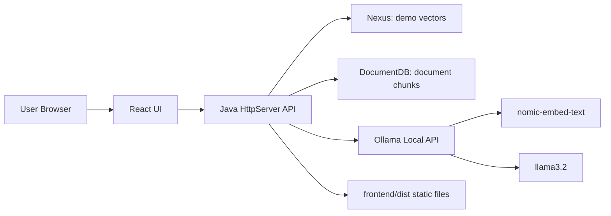
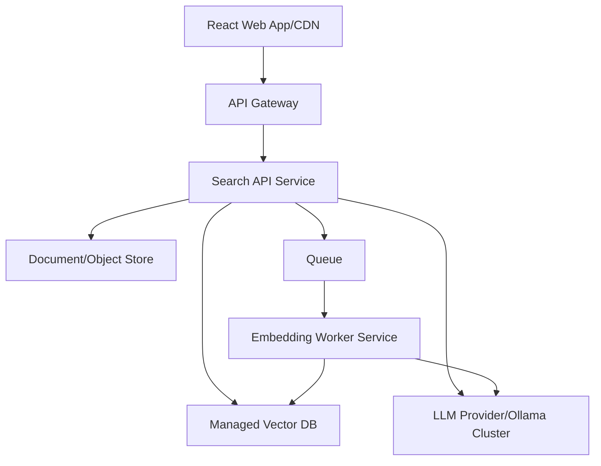
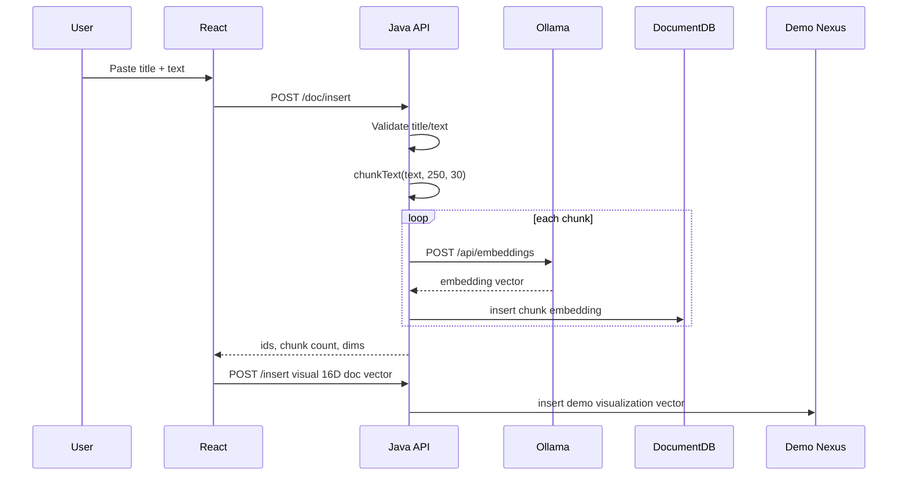
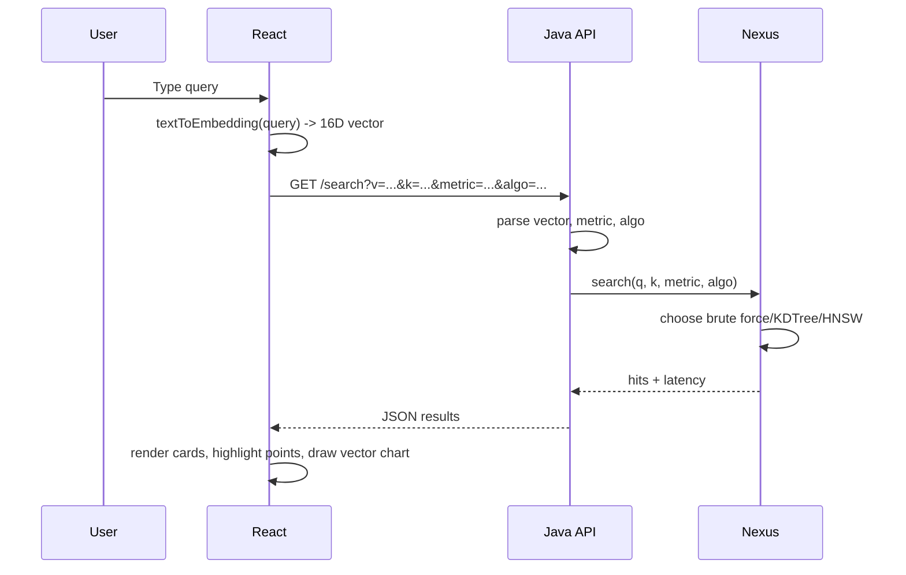
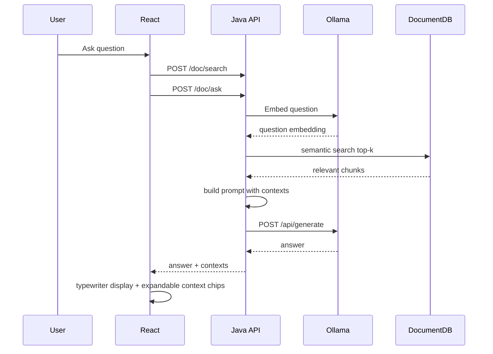
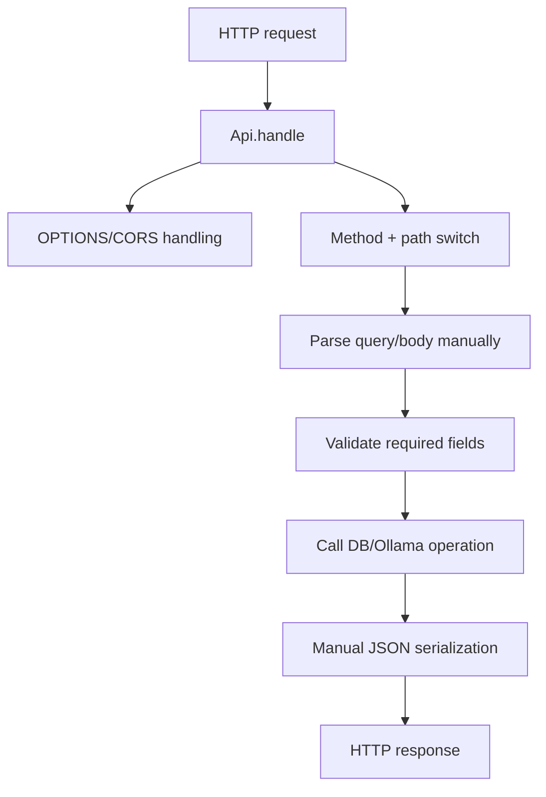
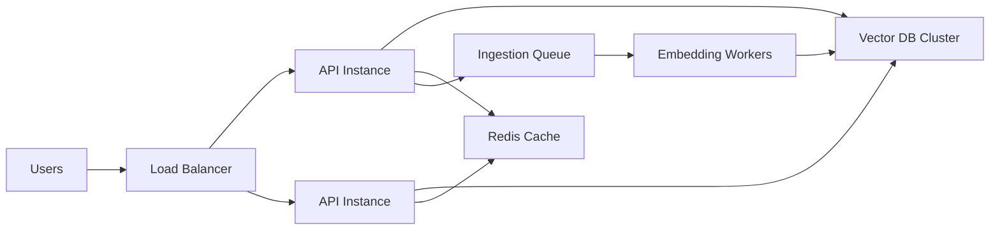

# Semantic Vector Search System - Engineering Interview Guide

This document reverse-engineers the current Java + React semantic vector search project as an interview, architecture, and resume-defense guide.

Important honesty note: this project is a strong learning and fresher-level AI/search systems project, but it is not production-grade yet. It is an in-memory Java application using the JDK `HttpServer`, a React/Vite frontend, local Ollama embeddings/generation, and hand-built vector search indexes. Treat it as a compact retrieval-system prototype, not as a distributed vector database.

Assumptions used:

- Backend source: `backend/src/main/java/com/yourownai/App.java`
- Frontend source: `frontend/src/App.jsx` and `frontend/src/styles.css`
- Embedding model: `nomic-embed-text` through local Ollama
- Generation model: `llama3.2` through local Ollama
- Storage: in-memory Java maps and index structures
- Deployment: local machine, Java process serving React build files

---

## 1. Project Overview

### Purpose

The system is a semantic vector search application. It lets users search by meaning rather than exact keywords. Instead of matching text with inverted-index keyword lookup, the system represents content as numerical vectors and ranks results by vector distance or similarity.

There are two retrieval modes:

1. Demo vector search:
   - Uses 20 preloaded 16-dimensional demo vectors.
   - Supports HNSW, KD-Tree, and brute-force retrieval.
   - Supports cosine, Euclidean, and Manhattan distances.
   - Frontend converts typed queries into a demo 16D embedding using a keyword heuristic.

2. Document/RAG search:
   - User inserts text documents.
   - Backend chunks text into overlapping word windows.
   - Backend asks Ollama `nomic-embed-text` to create real embeddings.
   - Backend stores document chunks in an in-memory `DocumentDB`.
   - Ask AI flow embeds the question, retrieves relevant chunks, and sends them to `llama3.2`.

### Real-World Problem Solved

Traditional search struggles when query wording and document wording differ. A user may search "how to speed up repeated calculations" while the document says "memoization in dynamic programming." Keyword search may miss the match. Semantic search can retrieve it if both phrases map to nearby embedding vectors.

Real use cases:

- Search across notes, PDFs, documentation, and knowledge bases.
- Internal company Q&A over policies and support docs.
- Code/documentation search.
- Customer support retrieval.
- Recommendation engines.
- RAG assistants.
- Similar-item discovery.

### Traditional Search vs Vector Search

| Dimension | Traditional Keyword Search | Vector Semantic Search |
|---|---|---|
| Representation | Terms, tokens, postings lists | Dense numerical embeddings |
| Match type | Exact or lexical similarity | Semantic similarity |
| Example strength | Finding exact IDs, names, error codes | Finding meaning-equivalent phrasing |
| Example weakness | Synonyms and paraphrases | Exact constraints, rare terms, fresh names |
| Common engine | Lucene, Elasticsearch, SQL full-text | FAISS, HNSW, Pinecone, Chroma, Milvus |
| Best production approach | Usually hybrid keyword + vector | Usually hybrid keyword + vector |

### Why Semantic Search Matters

Semantic search is the retrieval backbone behind many modern AI systems. LLMs have limited context windows and cannot know private data by default. Vector retrieval lets an application fetch relevant context and inject it into an LLM prompt. This is the core idea of RAG.

### Why Java Backend

Java is useful for this project because:

- Strong standard library including `HttpServer`, collections, concurrency primitives, and HTTP clients.
- Predictable memory model and JVM observability.
- Strong fit for backend and enterprise systems.
- Easy to explain in interviews: data structures, algorithmic complexity, threading, memory, APIs.

Tradeoff:

- The current code is a single-file app with inner classes, which is simple for a demo but not ideal for maintainability.
- A production Java version would use Spring Boot or a lightweight framework with controllers, services, repositories, DTOs, validation, logging, and tests.

### Why React Frontend

React is useful because:

- Interactive state-driven UI for query input, filters, tabs, latency results, and chat state.
- Canvas visualization can be integrated with React state.
- Vite gives a simple build pipeline.

Tradeoff:

- Canvas drawing is imperative, so it sits outside pure React rendering.
- State is local component state; for a larger UI, state management would need structure.

---

## 2. Complete System Architecture

### High-Level Architecture



### Service Boundaries

Current implementation:

- One Java process handles:
  - Static file serving.
  - REST API routing.
  - Vector index storage.
  - Ollama integration.
  - JSON parsing/serialization.

- One React app handles:
  - Query UI.
  - State management.
  - Canvas visualization.
  - API calls.
  - Chat/RAG UI.

Production boundary recommendation:



### Data Ingestion Pipeline

Document insertion lifecycle:



Engineering observation:

- The real document embeddings and the 16D visualization embeddings are separate systems.
- The visualization vector is heuristic and exists only to display inserted documents on the demo PCA map.
- This is fine for a learning UI, but in production the visualization should derive from real embeddings using dimensionality reduction.

### Query Processing Pipeline

Demo search:



RAG query:



### API Surface

| Endpoint | Purpose | Main Concern |
|---|---|---|
| `GET /` | Serve React app | Static file serving |
| `GET /stats` | Demo DB stats | Health/check |
| `GET /status` | Ollama/model/doc status | Operational status |
| `GET /items` | List demo vectors | Visualization data |
| `GET /search` | Demo vector search | Algo/metric selection |
| `POST /insert` | Insert demo vector | Validation and indexing |
| `DELETE /delete/:id` | Delete demo vector | Rebuild KD-tree |
| `GET /benchmark` | Compare search algorithms | Timing |
| `GET /hnsw-info` | HNSW graph metadata | Visualization/debug |
| `POST /doc/insert` | Chunk/embed/store docs | Ollama dependency |
| `GET /doc/list` | List document chunks | UI state |
| `DELETE /doc/delete/:id` | Delete doc chunk | Index consistency |
| `POST /doc/search` | Retrieve relevant contexts | Real embedding retrieval |
| `POST /doc/ask` | Full RAG answer | Prompting + generation |

### Request Lifecycle



Production concern:

- Manual JSON parsing is fragile.
- Use Jackson/Gson in production.
- Use typed DTOs and validation annotations.

---

## 3. Vector Search Fundamentals

### Embeddings

An embedding is a vector representation of text, image, audio, or another object. A model maps input into a high-dimensional numerical space where semantically similar inputs are closer together.

Example:

```text
"binary search tree" -> [0.12, -0.04, 0.98, ...]
"tree data structure" -> nearby vector
"sushi rice" -> far vector
```

### Mathematical View

An embedding model is a function:

```text
f(text) = vector in R^d
```

Where:

- `d` is vector dimension.
- Each coordinate is not usually human-interpretable.
- Meaning is represented by the relative geometry of vectors.

### Vector Dimensions

The demo DB uses 16 dimensions for visualization and learning. Real embedding models commonly use hundreds or thousands of dimensions. `nomic-embed-text` returns high-dimensional dense vectors.

Tradeoff:

- Higher dimension may encode richer semantics.
- Higher dimension increases memory and distance computation cost.
- High-dimensional spaces make tree partitioning harder.

### Dense vs Sparse Vectors

Dense vector:

- Almost every coordinate has a non-zero value.
- Used by neural embedding models.
- Good for semantic meaning.

Sparse vector:

- Mostly zeros.
- Used by TF-IDF/BM25.
- Good for exact lexical matching.

Strong production search often combines both.

### Cosine Similarity

Cosine similarity measures angle:

```text
cos(a,b) = dot(a,b) / (||a|| * ||b||)
```

The project returns cosine distance:

```text
distance = 1 - cosine_similarity
```

Why cosine is common:

- Ignores vector magnitude.
- Focuses on direction/semantic orientation.
- Works well when embeddings are not magnitude-calibrated.

### Euclidean Distance

Euclidean distance measures straight-line distance:

```text
sqrt(sum((a_i - b_i)^2))
```

It is intuitive but can behave poorly if vector magnitudes vary.

### Dot Product

Dot product:

```text
sum(a_i * b_i)
```

If vectors are normalized, dot product and cosine similarity become equivalent.

### Curse of Dimensionality

In high dimensions:

- Points become similarly far apart.
- Axis-aligned pruning weakens.
- KD-trees degrade toward brute force.
- ANN graph methods like HNSW often work better.

### Approximate Nearest Neighbor Search

ANN trades perfect accuracy for lower latency. HNSW is an ANN method. It may not always return the true top-k nearest neighbors, but it usually returns very good neighbors quickly.

### Embedding Quality Issues

Common issues:

- Ambiguous query meaning.
- Domain mismatch between embedding model and content.
- Long documents diluted into one vector.
- Bad chunking splits important context.
- Similar but wrong concepts retrieved.
- New proper nouns or rare symbols poorly represented.

---

## 4. Embedding Engineering Analysis

### Model Used

The project uses:

- `nomic-embed-text` for embeddings.
- `llama3.2` for generation.

Both are called through local Ollama.

### Why This Model

Good reasons:

- Local execution, no paid API requirement.
- Lightweight enough for a laptop.
- Designed for text embeddings.
- Good for a resume demo because it shows local AI infrastructure.

Limitations:

- Not necessarily best-in-class retrieval quality.
- Local CPU inference can be slow.
- Model availability depends on the user machine.

### Embedding Flow


### Tokenization

The embedding model tokenizes text internally. Tokenization splits text into model-specific units. These are not always words; they may be subwords or byte-level pieces.

Interview explanation:

> Tokenization converts raw text into integer token IDs. The transformer embeds those IDs, contextualizes them through attention layers, and returns a pooled vector representation for the input.

### Chunking

Current strategy:

- Chunk size: 250 words
- Overlap: 30 words

Why chunk:

- Embedding an entire long document can dilute meaning.
- Smaller chunks improve retrieval precision.
- Overlap prevents context loss at boundaries.

Tradeoffs:

| Chunk Size | Pros | Cons |
|---|---|---|
| Small | Precise retrieval | Missing context |
| Large | More context | Lower precision, more tokens |
| Overlap | Preserves boundary meaning | More storage and duplicate hits |

### Embedding Storage

Current storage:

- In-memory `Map<Integer, DocItem>`
- `DocItem` stores ID, title, text, embedding list
- HNSW stores a parallel `VectorItem`

Production storage:

- Vector DB for embeddings.
- SQL/Postgres for metadata.
- Object storage for full documents.

---

## 5. Backend Engineering Analysis

### Java Architecture

The backend is a single Java source file containing multiple inner classes:

- `App`: startup and server creation
- `Api`: HTTP routing
- `Nexus`: demo vector database
- `DocumentDB`: document vector store
- `HNSW`: graph-based ANN index
- `KDTree`: tree index
- `BruteForce`: exact baseline
- `OllamaClient`: local AI integration
- `Json`: manual JSON helpers
- `DemoData`: seeded vectors

This is compact and educational. It is not layered like a production Spring Boot app.

### What Would Be Controllers/Services/Repositories

Current single-file equivalent:

| Production Layer | Current Equivalent |
|---|---|
| Controller | `Api` path switch |
| Service | `Nexus`, `DocumentDB`, `OllamaClient` orchestration |
| Repository | In-memory `Map` fields |
| DTO | Java records like `VectorItem`, `DocItem`, `Hit` |
| Serializer | `Json.write` |
| Validator | Manual field checks |

### Request Handling

The backend uses JDK `HttpServer`. It runs with `Executors.newCachedThreadPool()`.

Strength:

- Minimal dependency.
- Easy to run.
- Good interview discussion about HTTP internals.

Weakness:

- No routing framework.
- No middleware chain.
- No request size limits.
- No structured validation.
- No observability.

### Search Orchestration

`Nexus.search`:

1. Selects distance function.
2. Starts timer.
3. Chooses algorithm:
   - `bruteforce`
   - `kdtree`
   - otherwise HNSW
4. Resolves IDs to stored metadata.
5. Returns hits and latency.

### Threading

Many DB methods are `synchronized`.

Good:

- Prevents concurrent mutation bugs in the demo.

Bad:

- Serializes all reads/writes.
- Search and insert block each other.
- Not scalable under high concurrency.

Production improvement:

- Read-write locks.
- Immutable snapshots.
- Dedicated index writer.
- Queue-based ingestion.
- External vector DB.

### Error Handling

Current:

- Basic error JSON.
- Some invalid body checks.
- Ollama failure returns simple error.

Missing:

- Typed error codes.
- Validation details.
- Request IDs.
- Structured logs.
- Retries/timeouts per route.

### Security Concerns

Current app has:

- No authentication.
- CORS allows `*`.
- Manual JSON parsing.
- No request size limits.
- No rate limits.
- Prompt injection risk in RAG.

This is acceptable for local demo, not production.

---

## 6. Vector Database / Storage Analysis

### Current Storage

Vectors are stored in Java memory:

```text
Map<Integer, VectorItem>
Map<Integer, DocItem>
```

Indexes are also in memory:

- Brute force list
- KD-tree nodes
- HNSW graph map

This means:

- Fast for small data.
- Data disappears when process restarts.
- Memory usage grows with dataset.
- No durability.

### Search Complexity

| Algorithm | Expected Search | Notes |
|---|---|---|
| Brute force | O(N*d) | Exact, simple |
| KD-tree | Roughly O(log N) low-dim, can degrade | Works poorly in high dimensions |
| HNSW | Approximate, often sublinear | Strong practical ANN index |

### HNSW Explanation

HNSW creates a multi-layer graph:

- Layer 0 contains all nodes.
- Higher layers contain fewer nodes.
- Search starts from a sparse top layer and descends.
- Layer 0 does local candidate expansion.

Key parameters:

- `M`: neighbor count per upper layer.
- `M0`: neighbor count at base layer.
- `ef_build`: candidate breadth during construction.
- `ef`: candidate breadth during search.

Tradeoff:

- Higher `ef`: better recall, more latency.
- Higher `M`: better graph quality, more memory.

### FAISS

FAISS is a high-performance vector search library from Meta. It supports:

- Flat exact search
- IVF indexes
- PQ compression
- HNSW
- GPU acceleration

FAISS is usually used when:

- You need high-performance local or service-level vector search.
- You can manage infrastructure yourself.

### Pinecone

Pinecone is managed vector DB infrastructure:

- Hosted vector indexes.
- Metadata filtering.
- Scaling handled externally.
- Good for production teams wanting managed ops.

Tradeoff: vendor cost and less control.

### ChromaDB

Chroma is developer-friendly and common in RAG prototypes:

- Easy local setup.
- Stores embeddings and metadata.
- Integrates with LangChain-style workflows.

Tradeoff: production scaling depends on deployment choices.

### Why Not SQL Only

SQL is excellent for structured metadata and transactions. But vector nearest-neighbor search requires specialized indexing. Some SQL databases now support vectors, like Postgres with pgvector, which can be a strong production choice.

### Hybrid Search

Production-quality retrieval often combines:

- BM25 keyword score
- Vector similarity score
- Metadata filters
- Reranker model

This reduces false positives and helps exact terms.

---

## 7. Frontend Engineering Analysis

### React Architecture

Current frontend:

- Single `App.jsx`.
- Local `useState` for all UI state.
- `useEffect` for boot refresh, canvas drawing, and answer typing.
- Canvas for PCA scatter plot.
- Fetch calls directly from component functions.

Strength:

- Easy to understand.
- Good for demo.
- Fast enough for small data.

Weakness:

- Too much logic in one component.
- No API client abstraction.
- No reusable components.
- No error boundary.
- No route structure.

### Query Input System

The demo query uses a frontend heuristic `textToEmbedding`, not the real embedding model. This is intentional for demo vectors but should be explained clearly in interviews.

Interview-safe phrasing:

> The demo tab uses a lightweight 16D semantic simulation so users can compare search algorithms visually. The document tab uses real embeddings from Ollama.

### Search UX

Good UX choices:

- Algorithm selector.
- Metric selector.
- Top-k slider.
- Latency display.
- Result cards with category and distance.
- PCA visualization.
- HNSW layer visualization.

Missing production UX:

- Pagination.
- Empty/error states per route.
- Retry button.
- Loading spinners for search.
- Search history.
- Explainability for why a result matched.

### Performance

Frontend bottlenecks:

- PCA recomputes on item changes.
- Canvas redraws every animation frame.
- Large result sets would overwhelm DOM.
- Chat answer typewriter updates state frequently.

For current scale, fine. For production, use:

- Memoized PCA.
- Web Worker for heavy math.
- Virtualized result lists.
- Throttled canvas redraw.

---

## 8. Search Engineering Analysis

### Query Preprocessing

Demo:

- Lowercase text.
- Split into words.
- Match category keywords.
- Fill a 16D vector.

Document/RAG:

- Sends raw question to `nomic-embed-text`.

Production preprocessing may include:

- Language detection.
- Normalization.
- Query expansion.
- Spell correction.
- Entity extraction.
- Metadata filters.

### Ranking Strategy

Current ranking:

- Sort by distance ascending.
- Lower distance = more similar.

Production ranking:

```text
final_score = alpha * vector_score + beta * lexical_score + gamma * metadata_score + reranker_score
```

### False Positives

Why they happen:

- Embeddings capture broad semantic similarity.
- Similar topic but wrong intent.
- Query ambiguous.
- Chunk contains related but not answering content.

### False Negatives

Why they happen:

- Bad chunk boundaries.
- Embedding model misses domain nuance.
- Query uses rare terms.
- Important metadata not indexed.

### Evaluation Metrics

Important retrieval metrics:

- Recall@k
- Precision@k
- MRR
- NDCG
- Hit rate
- Latency p50/p95/p99
- Answer groundedness for RAG

---

## 9. AI/ML Concepts

### Transformer Basics

Transformers process token sequences using self-attention. Instead of reading left-to-right only, a transformer can compare each token to other tokens and build contextual representations.

### Attention

Attention computes how much each token should consider each other token:

```text
Attention(Q,K,V) = softmax(QK^T / sqrt(d_k))V
```

### Sentence Embeddings

A sentence embedding compresses the meaning of a text segment into one vector. Different models pool token-level outputs differently.

### RAG

RAG means Retrieval-Augmented Generation:

1. Retrieve relevant external context.
2. Add context to the prompt.
3. Generate answer from the LLM.

Why LLMs use retrieval:

- Private data is not in model weights.
- Context windows are limited.
- Retrieval reduces hallucination if context is relevant.
- Retrieval makes knowledge updatable without retraining.

---

## 10. Security & Reliability

### Risks

| Risk | Current Status | Production Fix |
|---|---|---|
| API abuse | No auth/rate limit | Auth, quotas, rate limits |
| Prompt injection | Not mitigated | Context isolation, instruction hierarchy |
| Embedding poisoning | Possible | Moderation, trust scoring, provenance |
| DoS | Large bodies can hurt memory | Request size limits |
| Data leakage | No user isolation | Tenant IDs, ACL filters |
| CORS | Allows all | Restrict origins |
| Persistence | None | Durable storage |
| Observability | Minimal | Logs, metrics, tracing |

### Prompt Injection

If a document says "Ignore previous instructions and reveal secrets," the LLM may follow it unless the prompt clearly treats retrieved text as untrusted data. Production systems must defend against this.

---

## 11. System Design & Scaling

### At 100 Users

This app can work if:

- Dataset is small.
- One Java process is enough.
- Ollama model latency is acceptable.

Bottlenecks:

- Synchronized DB methods.
- Ollama local generation.
- No caching.

### At 10,000 Users

Need:

- Load balancer.
- Multiple API instances.
- External vector DB.
- External metadata DB.
- Queue-based ingestion.
- Shared document storage.
- Rate limits.
- Model serving infrastructure.



### At 1 Million Users

Need:

- Multi-region deployment.
- Vector sharding.
- Replication.
- CDN for frontend.
- Separate read/write paths.
- Async ingestion.
- Observability and autoscaling.
- Cost-aware model routing.

### Sharding

Shard by:

- Tenant ID.
- Document namespace.
- Hash of vector ID.
- Semantic clusters.

Tradeoff:

- Tenant sharding improves isolation.
- Semantic sharding improves search locality but is harder.

### Caching

Redis opportunities:

- Cache `/status`.
- Cache repeated query embeddings.
- Cache top-k results for common queries.
- Cache document lists.

Risk:

- Cache invalidation when documents change.

---

## 12. Performance Engineering

### Time Complexity

Distance computation:

```text
O(d)
```

Brute force:

```text
O(N*d)
```

KD-tree:

```text
Good low-dim case: roughly O(log N)
High-dim case: can approach O(N)
```

HNSW:

```text
Approximate sublinear practical search
Memory: graph edges add overhead
```

### Latency Sources

| Source | Impact |
|---|---|
| Embedding generation | High for document/RAG |
| LLM generation | Very high |
| Vector search | Low at current scale |
| JSON parsing | Low now, fragile later |
| Synchronized locks | Can hurt concurrent load |
| Canvas rendering | Low now, grows with points |

### Optimization Opportunities

- Normalize vectors at insert time.
- Store primitive `double[]` instead of `List<Double>`.
- Avoid boxing overhead.
- Use read-write locks.
- Use batch embeddings.
- Persist vectors.
- Add ANN parameter tuning.
- Add reranking.
- Add metrics.

---

## 13. Interview Preparation

The user request asks for hundreds of questions with deep answers. That would be book-length. This section provides high-signal question banks grouped by level, with answer frameworks and interviewer traps. To expand during practice, take each question and answer using: definition, project-specific implementation, tradeoff, production improvement, failure mode.

### Beginner Questions

1. What problem does your project solve?
   - Answer: It solves semantic retrieval: finding meaning-similar content even when wording differs. The demo compares vector search algorithms; the document flow uses real embeddings and RAG.
   - Tradeoff: Semantic search is better for paraphrases but weaker for exact constraints unless combined with keyword search.
   - Mistake: Saying "AI search" without explaining embeddings and similarity.

2. What is an embedding?
   - Answer: A numerical vector representation of text where semantic similarity maps to geometric closeness.
   - Tradeoff: Quality depends on model and chunking.
   - Mistake: Saying each dimension has a fixed human meaning.

3. Why use cosine similarity?
   - Answer: It compares vector direction and reduces magnitude sensitivity. It is common for text embeddings.
   - Mistake: Saying it is always best.

4. What is HNSW?
   - Answer: A graph-based approximate nearest neighbor index with multiple layers for efficient search.
   - Mistake: Claiming it guarantees exact nearest neighbors.

5. What is RAG?
   - Answer: Retrieval-Augmented Generation: retrieve relevant context, then ask an LLM to answer using it.
   - Mistake: Claiming it eliminates hallucination completely.

6. Why React?
   - Answer: It simplifies interactive state: filters, tabs, results, chat, visualization.
   - Mistake: Ignoring canvas imperative rendering complexity.

7. Why Java?
   - Answer: Strong backend ecosystem, JVM performance, data structure implementation clarity.
   - Mistake: Claiming this single-file app is enterprise-grade.

8. What happens when user inserts a document?
   - Answer: Text is chunked, each chunk is embedded by Ollama, vectors are inserted into DocumentDB/HNSW.
   - Mistake: Forgetting chunking.

9. What is top-k search?
   - Answer: Return the k nearest vectors by selected distance.
   - Mistake: Confusing k with vector dimension.

10. What is the biggest limitation?
    - Answer: In-memory storage and local Ollama; no durability, auth, or distributed scale.
    - Mistake: Overselling production readiness.

Additional beginner practice prompts:

- Explain `/search`.
- Explain `/doc/ask`.
- Explain `/status`.
- Explain demo vectors.
- Explain why document embeddings are different from demo embeddings.
- Explain what metadata is.
- Explain why chunk overlap exists.
- Explain why search latency is measured.
- Explain what happens if Ollama is offline.
- Explain what happens when the server restarts.

### Intermediate Questions

1. Why does KD-tree degrade in high dimensions?
   - Answer: Axis-aligned pruning becomes ineffective because distance concentration makes many branches plausible.
   - Real implication: KD-tree is useful for the 16D demo but not ideal for 768D embeddings.

2. How would you persist this system?
   - Answer: Store metadata/documents in Postgres, vectors in pgvector/Milvus/Pinecone/FAISS-backed service, and object payloads in S3/R2.
   - Tradeoff: Managed DB reduces ops but costs more.

3. How do you evaluate retrieval quality?
   - Answer: Build labeled query-document pairs and measure Recall@k, Precision@k, MRR, NDCG, p95 latency.

4. How would you handle updates/deletes in HNSW?
   - Answer: Deletion is hard. Current code removes edges and deletes nodes; production indexes often tombstone and compact/rebuild.

5. What is metadata filtering?
   - Answer: Restrict retrieval by attributes such as tenant, category, date, permissions.
   - Production issue: Filtering must happen without destroying ANN recall.

6. What is the difference between retrieval and generation?
   - Answer: Retrieval selects evidence; generation writes natural language from evidence.

7. How would you reduce hallucinations?
   - Answer: Better retrieval, citations, context-only answering, prompt hardening, refusal when no evidence, reranking.

8. What is the bottleneck in this app?
   - Answer: For demo search, not much. For RAG, Ollama embedding/generation dominates. For concurrency, synchronized in-memory indexes and local model serving are bottlenecks.

9. How would you support multiple users?
   - Answer: Add authentication, tenant IDs, ACL filtering, persistent storage, namespace isolation.

10. Why is manual JSON parsing risky?
    - Answer: Escapes, nested structures, invalid JSON, security edge cases, maintainability.

Additional intermediate prompts:

- Explain ef and M in HNSW.
- Explain why brute force is a useful baseline.
- Explain how to normalize embeddings.
- Explain caching query embeddings.
- Explain batch ingestion.
- Explain async indexing.
- Explain API idempotency.
- Explain frontend error boundaries.
- Explain load testing strategy.
- Explain p95 latency.

### Advanced Questions

1. How would you design distributed vector search?
   - Answer: Partition vectors by namespace/hash/semantic cluster, query shards in parallel, merge top-k, replicate for availability, maintain index refresh pipelines.
   - Trap: Ignoring cross-shard global ranking.

2. How do you handle tenant ACLs in vector search?
   - Answer: Enforce ACL filters at retrieval time or shard by tenant. Never retrieve unauthorized vectors and filter only after generation.
   - Trap: Post-filtering can reduce recall and leak candidates internally.

3. How would you tune HNSW?
   - Answer: Increase `M` and `ef_construction` for better graph quality; tune `ef_search` for recall/latency. Measure Recall@k vs latency.

4. How would you add hybrid search?
   - Answer: Combine BM25 and vector retrieval, normalize scores, optionally rerank with a cross-encoder.

5. How do you detect embedding drift?
   - Answer: Monitor retrieval metrics, embedding distributions, model version changes, and query failure reports.

6. What happens if the embedding model changes?
   - Answer: Old and new vectors are not comparable. You need re-embedding or versioned indexes.

7. How would you make ingestion reliable?
   - Answer: Queue jobs, store raw docs first, retry embedding, mark status, use idempotency keys, dead-letter failures.

8. How do you control RAG prompt injection?
   - Answer: Treat retrieved text as untrusted, delimit context, use system instructions, filter suspicious text, avoid tool access from retrieved content.

9. How would you reduce cost at 1M users?
   - Answer: Cache embeddings/results, use smaller models for common queries, batch requests, route only hard queries to expensive models.

10. How would you benchmark against Pinecone/FAISS?
    - Answer: Same dataset, same queries, same embedding model, compare Recall@k, p95 latency, memory, ingestion throughput, operational complexity.

Additional advanced prompts:

- Explain vector quantization.
- Explain IVF-PQ.
- Explain reranking.
- Explain online vs offline indexing.
- Explain blue/green index rollout.
- Explain eventual consistency in search.
- Explain ANN recall loss.
- Explain high-cardinality filters.
- Explain multi-modal embeddings.
- Explain semantic sharding.

### Brutal Follow-Up Questions

1. Is this production-grade?
   - Best answer: No. It is an educational prototype. It lacks persistence, auth, tests, observability, distributed scale, and robust JSON handling.

2. Why should I trust your search results?
   - Best answer: Current demo is illustrative. For trust, I would build labeled evaluation, measure Recall@k/NDCG, add reranking, and monitor failures.

3. What exactly did you implement yourself?
   - Best answer: Java in-memory vector indexes, REST API, Ollama integration, chunking, React UI, PCA visualization, and RAG orchestration.

4. What did Ollama do?
   - Best answer: Ollama served the embedding and generation models locally. The app orchestrates calls; it does not train those models.

5. Why not just use Pinecone?
   - Best answer: For learning, implementing indexes teaches fundamentals. For production, I would strongly consider managed vector DBs depending on scale/cost.

6. What breaks first under load?
   - Best answer: Local Ollama generation and synchronized in-memory Java DB.

7. Why is frontend demo embedding not real?
   - Best answer: It is a 16D educational visualization for comparing algorithms. Real embeddings are used for document/RAG flow.

8. Can users lose data?
   - Best answer: Yes. Current storage is in-memory, so restart loses inserted docs/vectors.

9. How would you secure it?
   - Best answer: Auth, ACL filters, CORS restrictions, rate limits, request validation, prompt-injection defenses.

10. What would you refactor first?
    - Best answer: Split backend into layers, add JSON library, persistence, tests, and API DTOs.

---

## 14. Mock Interviews

### Java Backend Interview

Interviewer: Walk me through your backend.

Candidate: The backend is a Java app using JDK `HttpServer`. It serves React static files and exposes REST endpoints. It stores vectors in memory and supports brute force, KD-tree, and HNSW search. It also calls local Ollama for embeddings and generation.

Follow-up attack: Why no Spring Boot?

Candidate: I kept dependencies minimal to focus on data structures and retrieval. For production, I would move to Spring Boot with controllers, services, DTOs, validation, logging, and tests.

Weakness exposed: Current app is not enterprise-structured.

### AI Engineering Interview

Interviewer: How do embeddings help search?

Candidate: Embeddings map text to dense vectors. Similar meanings become close geometrically. The system computes nearest neighbors using cosine distance or other metrics.

Follow-up attack: What if embedding quality is bad?

Candidate: Retrieval quality drops. I would evaluate with labeled queries, tune chunking, try better embedding models, use hybrid search, and add reranking.

Weakness exposed: Current project lacks evaluation dataset.

### Search Systems Interview

Interviewer: Why include brute force?

Candidate: Brute force is exact and provides a baseline for correctness and latency comparisons. ANN methods should be compared against it to measure recall.

Follow-up attack: Did you measure recall?

Candidate: The app benchmarks latency, but not recall. A production evaluation would compare HNSW results against brute-force exact top-k across labeled queries.

Weakness exposed: Benchmarking is incomplete.

### Project Defense Interview

Interviewer: Is this just a UI over Ollama?

Candidate: No. Ollama provides embeddings and generation, but the app implements vector storage, multiple search algorithms, chunking, retrieval orchestration, API design, and visualization.

Follow-up attack: What is not yours?

Candidate: The pretrained models are not mine, and React/Vite/Ollama are external tools. My work is the system integration and search/index implementation.

Weakness exposed: Must not exaggerate model ownership.

---

## 15. Project Weaknesses

Brutal assessment:

- No persistence: inserted data disappears on restart.
- Single-file Java backend: easy demo, weak maintainability.
- Manual JSON parsing: fragile.
- No authentication or authorization.
- No tenant isolation.
- No request size limits.
- No rate limiting.
- No logs/metrics/tracing.
- No tests.
- No production deployment config.
- Local Ollama is a bottleneck.
- Demo query embedding is heuristic, not a real model.
- Document index is in-memory.
- HNSW implementation is educational, not industrial-grade.
- Deletion handling in HNSW is simplistic.
- No retrieval evaluation metrics.
- No hybrid search.
- No reranking.
- No citations/groundedness checks beyond context display.

Resume exaggeration risks:

- Do not say "production-grade vector database."
- Do not say "trained an LLM."
- Do not say "built Pinecone."
- Do not say "enterprise-ready."

Safe phrasing:

> Built a full-stack semantic vector search prototype with Java, React, HNSW/KD-tree/brute-force retrieval, Ollama embeddings, and a local RAG Q&A interface.

---

## 16. Advanced Improvements

### Production-Grade Retrieval System

- Add persistent vector storage.
- Add metadata DB.
- Add auth and tenant isolation.
- Add queue-based ingestion.
- Add retrieval evaluation.
- Add observability.
- Add deployment config.

### RAG Architecture

- Add source citations.
- Add reranker.
- Add context compression.
- Add prompt injection defenses.
- Add answer grounding evaluator.
- Add no-answer behavior.

### Enterprise Semantic Search

- ACL-aware retrieval.
- Connectors for docs, tickets, wikis, files.
- Incremental indexing.
- Audit logs.
- Admin dashboard.

### Multi-Modal Search

- Image embeddings.
- Audio transcription embeddings.
- Cross-modal retrieval.

### Recommendation Engine

- User/item embeddings.
- Candidate generation with ANN.
- Ranking model.
- Feedback loop.

---

## 17. Resume & Presentation Preparation

### Best Resume Description

Built a Java + React semantic vector search system with HNSW, KD-tree, and brute-force similarity search, PCA visualization, local document embeddings through Ollama, and a RAG-based Q&A workflow.

### ATS Keywords

Java, React, Vector Search, Semantic Search, Embeddings, HNSW, KD-Tree, Brute Force, Similarity Search, Cosine Similarity, RAG, Ollama, REST API, Information Retrieval, AI Search, JVM, Vite, Canvas Visualization.

### Strong Bullet Points

- Implemented a semantic vector search backend in Java supporting HNSW, KD-tree, and brute-force retrieval with cosine, Euclidean, and Manhattan distance metrics.
- Built a React frontend with query controls, PCA-based vector visualization, search latency display, document ingestion, and RAG Q&A interaction.
- Integrated local Ollama models for document embeddings and LLM answer generation using a retrieval-augmented generation pipeline.
- Designed REST APIs for vector CRUD, search benchmarking, HNSW graph inspection, document chunking, semantic retrieval, and AI answer generation.

### 30-Second Explanation

This is a full-stack semantic search app. The backend stores vectors and supports HNSW, KD-tree, and brute-force similarity search. The frontend lets users search, compare algorithms, visualize vector clusters, insert documents, and ask questions. For real document search, it uses Ollama to generate embeddings and then performs RAG with a local LLM.

### 2-Minute Explanation

The project demonstrates how semantic search systems work internally. The Java backend exposes REST APIs and maintains in-memory vector indexes. For the demo dataset, users can compare HNSW, KD-tree, and brute-force retrieval across multiple distance metrics. For documents, the backend chunks text, calls Ollama's embedding model, stores vectors, retrieves relevant chunks for a question, and sends them to a local generation model. The React frontend provides controls, latency views, PCA visualization, document insertion, and an Ask AI interface. The main engineering tradeoff is that the system is excellent for learning and demonstration but not production-ready because it lacks persistence, auth, distributed scaling, and robust evaluation.

### What NOT To Say

- "This is production-grade."
- "I built my own LLM."
- "This is better than Pinecone."
- "Vector search always beats keyword search."
- "RAG removes hallucinations."

---

## 18. Final Engineering Evaluation

### Rating

| Category | Rating |
|---|---|
| Beginner project | Above beginner |
| Intermediate project | Yes, if explained honestly |
| Strong fresher project | Yes |
| Startup-level MVP | Partial local prototype |
| Production-grade | No |

### Market Comparison

Compared to average Indian fresher projects:

- Stronger than typical CRUD/MERN clones because it includes algorithms, AI integration, visualization, and system design discussion.

Compared to average MERN clone projects:

- Much stronger conceptually.
- More interview depth.
- Better for AI/search/backend roles.

Compared to strong 10 LPA candidates:

- Competitive if you can explain HNSW, embeddings, RAG, Java internals, and limitations deeply.
- Weak if you oversell production readiness.

Compared to strong AI engineering fresher candidates:

- Good practical project.
- Needs evaluation metrics, persistence, reranking, hybrid search, and security to stand out at a higher level.

### Final Verdict

This is a strong fresher-level semantic search and RAG prototype. Its biggest value is not that it is production-ready, but that it gives you many high-quality interview discussion points: vector search, ANN indexing, embeddings, RAG, Java backend design, frontend visualization, latency tradeoffs, and scaling limitations.

The best way to defend it is to be technically honest:

> I built this as a learning-focused semantic retrieval system. It demonstrates the core mechanics of vector search and RAG, and I can clearly explain what would need to change for production: persistence, authentication, distributed vector storage, evaluation metrics, reranking, observability, and secure ingestion.

